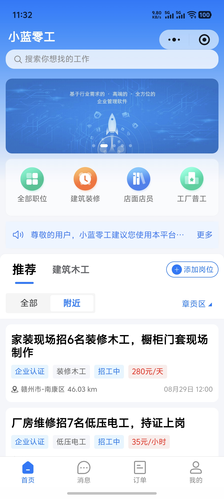
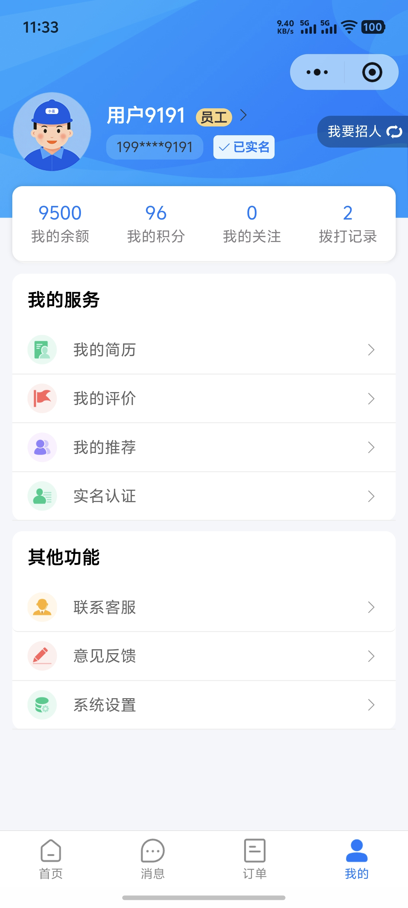
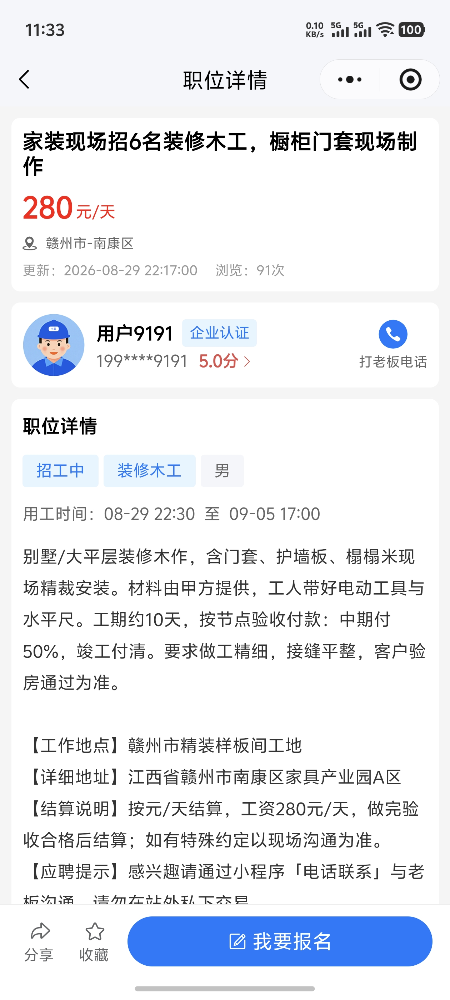
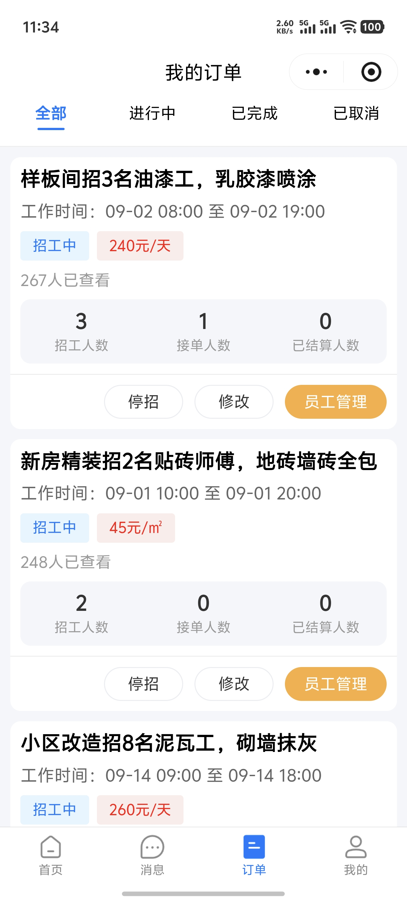
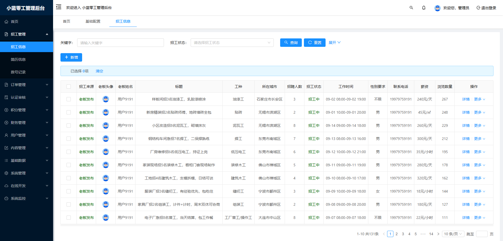
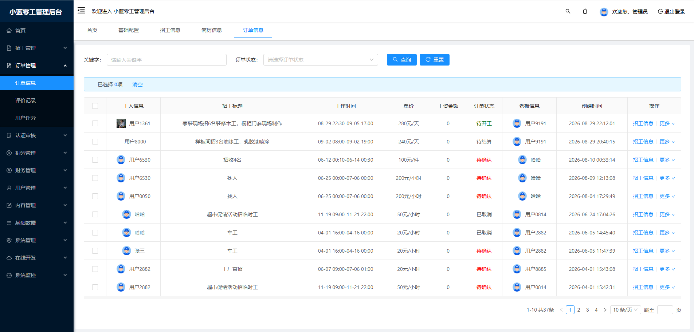
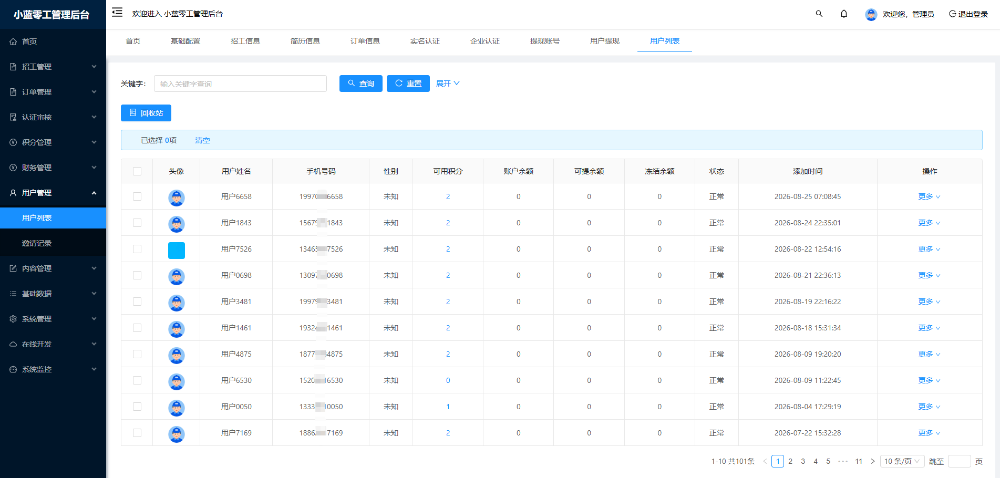
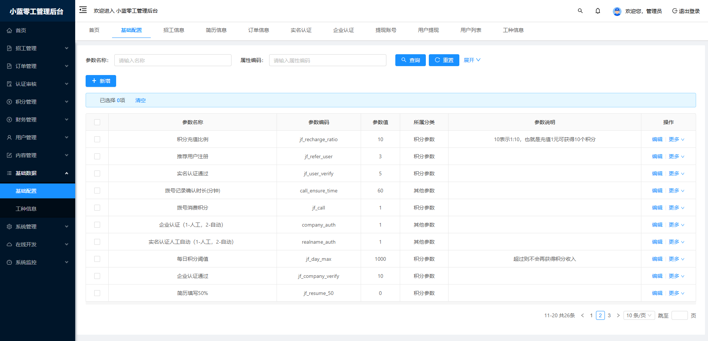

# 01 产品介绍

| 项 | 内容 |
|----|------|
| 产品 | 小蓝零工 / Job-Daily |
| 类型 | 日结 / 零工招工撮合平台 |
| 形态 | 开源三端一体（移动端 + 管理端 + 后端） |

---

## 1. 产品定位

本系统面向**日结工资、临时用工、蓝领零工**等场景，解决「快速发岗、快速到岗、线上留痕、线上结算」问题。

**不是**：传统简历投递型招聘网站、猎头 ATS、纯信息黄页。

**是**：撮合工人与老板完成一次短周期用工，并尽量在平台内完成确认、打卡、结算与评价。

---

## 2. 目标用户

| 角色 | 诉求 |
|------|------|
| 工人（member） | 找日结活、打卡证明、收工资、提现 |
| 老板（company） | 发岗、确认工人、看打卡、支付工资、评价 |
| 平台运营 | 审核岗位/认证、处理提现与异常单、内容与规则配置 |
| 二次开发方 | 私有部署、换皮、扩展行业规则 |

---

## 3. 核心价值主张

1. **闭环完整**：从发岗到提现主路径可跑通  
2. **三端齐备**：小程序获客 + 后台运营 + Java 业务中台  
3. **可私有化**：数据与商户号归属部署方  
4. **可演进**：订单状态机、资金校验、运营工作台等已按生产方向加固  

---

## 4. 范围与非目标

### 4.1 范围内

- 账号登录、角色切换、实名/企业认证（按配置）
- 岗位发布、审核、报名、确认、取消、超时处理
- 上下班打卡（规则可配置）
- 工资支付（微信/支付宝等，依赖部署方商户配置）
- 评价、积分道具、VIP（按模块启用）
- 提现审核、转账状态回写、对账与运营台

### 4.2 非目标（开源版不承诺）

- 全国流量获客与补贴运营
- 劳务派遣牌照、代发工资持牌能力（须运营方自备资质）
- 微服务拆分、Vue3 全面重写
- 开箱即用的「已开通」微信/支付商户（须自行申请）

---

## 5. 成功标准（部署验收）

- [ ] 工人与老板可完成一单：报名 → 确认 → 打卡 → 结算 → 评价  
- [ ] 支付回调幂等，无重复入账  
- [ ] 提现申请冻结正确，审核拒绝/转账失败可解冻  
- [ ] 管理端可完成岗位审核与提现处理  
- [ ] 生产密钥均外置，仓库无真实密钥提交  

---

## 6. 界面预览

### 移动端（UniApp 小程序）

| 首页 | 消息 |
|:----:|:----:|
|  |  |

| 工人订单 | 工人「我的」 |
|:----:|:----:|
|  |  |

| 职位详情 | 老板订单 |
|:----:|:----:|
|  |  |

### 管理端（Vue 后台）

| 招工信息 | 订单信息 |
|:----:|:----:|
|  |  |

| 用户列表 | 基础配置 |
|:----:|:----:|
|  |  |

更多说明见 [images/README.md](images/README.md)。

---

## 7. 相关文档

- [功能清单](03-功能清单.md)
- [业务说明](07-业务说明.md)
- [商业支持](10-商业支持.md)
